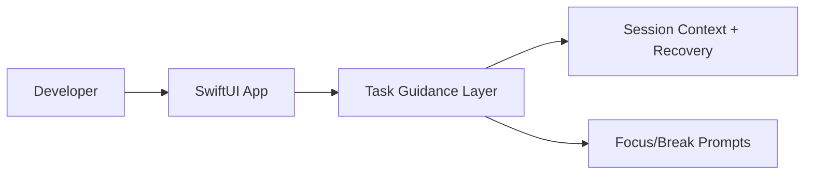

# NeuroShell

macOS SwiftUI terminal assistant with structured task guidance, session context recovery, and focus-oriented workflow pacing.

**Tech spec:** [docs/TECH_SPEC.md](docs/TECH_SPEC.md)

[]()
[]()
[]()
[]()

An AI-powered terminal assistant designed for ADHD/AuDHD users struggling with executive dysfunction. It breaks complex commands into simple steps, provides gentle reminders, reduces decision paralysis with smart suggestions, and offers distraction-free workflows.


## ANZSCO 261312 Skills Snapshot
- Native application design and implementation using Swift/SwiftUI.
- User-centered software development for practical productivity outcomes.
- Maintainable project structuring and documentation for engineering handover.

## ✨ Features

- 🧩 **Task Chunking** — Break big scary commands into small friendly steps
- ⏰ **Time-Blindness Alerts** — Gentle reminders because time isn't real
- 🧠 **Hyperfocus Protection** — Detects loops and nudges you to breathe
- 💡 **Smart Suggestions** — Type in plain English, get the right command
- 🫁 **Breathing Exercises** — Four guided patterns for in-the-moment regulation
- 📍 **"Where Was I?"** — One-click context recovery for scattered brains
- 😊 **Mood Awareness** — Adapts its tone to how you're feeling
- ⚡ **Quick Actions** — No memorization needed, just tap

## 🚀 Getting Started

### Requirements
- macOS 14.0+
- Xcode 15+

### Build & Run
```
git clone https://github.com/jv-darkheartlabs/NeuroShell.git
cd NeuroShell
open NeuroShell.xcodeproj
```
Press **⌘R** in Xcode to build and run.

### Download
Check [Releases](https://github.com/jv-darkheartlabs/NeuroShell/releases) for pre-built `.app` binaries.

## 📖 Documentation

See [PROJECT_OVERVIEW.md](PROJECT_OVERVIEW.md) for full architecture, AI features, and implementation details.

## ⌨️ Keyboard Shortcuts

| Shortcut | Action |
|----------|--------|
| ⌘N | New Session |
| ⌘K | Clear Terminal |
| ⌘⇧B | Take a Break |
| ⌘⇧W | Where Was I? |
| ⌘⇧F | Toggle Focus Mode |

## 🤝 Contributing

Contributions welcome! This project is built for neurodivergent developers, ideally by them too.

## 📄 License

MIT — use it, fork it, make it yours.

---

<p align="center">
  <b>Made with 💛 for neurodivergent minds</b><br/>
  Your brain isn't broken — it's just wired differently.
</p>


## Problem
Traditional terminal workflows can create cognitive overload for neurodivergent developers, especially during multi-step troubleshooting.

## Solution
A SwiftUI-based assistant that breaks command work into structured steps, supports context recovery, and encourages sustainable workflow pacing.

## Architecture Diagram


## Tech Stack
- Swift
- SwiftUI
- macOS app architecture
- Xcode tooling

## Setup Instructions
```bash
git clone https://github.com/jv-darkheartlabs/NeuroShell.git
cd NeuroShell
open NeuroShell.xcodeproj
```

## Testing
- Build and run from Xcode (⌘R)
- Optional CI/local build check: xcodebuild -scheme NeuroShell -configuration Debug build

## ANZSCO 261312 Competency Evidence
- Application design and implementation with native macOS technologies.
- User-experience driven software development for operational reliability.
- Maintainable project structuring and technical documentation.

## Commit Convention
Use Conventional Commits for presentation clarity:
- `feat(scope): add new user-facing capability`
- `fix(scope): resolve functional defect`
- `test(scope): add or improve automated tests`
- `docs(readme): improve project documentation`

## Evidence Map
- `NeuroShell/`
- `NeuroShell.xcodeproj`
- `PROJECT_OVERVIEW.md`
- `docs/TECH_SPEC.md`

---

**Maintained by:** [Dark Heart Labs](https://darkheartlabs.technology)  
**Author:** Jennifer ([@jv-darkheartlabs](https://github.com/jv-darkheartlabs))  
**Site:** https://darkheartlabs.technology
