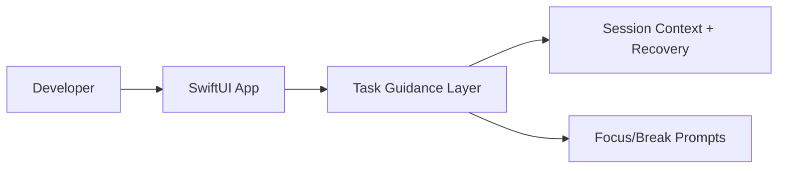

# Technical Specification — NeuroShell

## Overview

macOS SwiftUI terminal assistant that structures command work into guided steps, session context recovery, and focus-oriented workflow pacing.

## Problem statement

Traditional terminal workflows can produce high cognitive load during multi-step troubleshooting, especially when operators lose session context between interruptions.

## Solution summary

A native macOS application that decomposes command tasks, surfaces recovery affordances, and provides optional pacing prompts without replacing the underlying shell.

## Architecture

### Components

| Component | Responsibility |
|-----------|----------------|
| `NeuroShell/` | Application sources and views |
| `NeuroShell.xcodeproj` | Xcode project and build settings |
| `PROJECT_OVERVIEW.md` | Extended architecture and feature notes |

## Tech stack

| Layer | Technology |
|-------|------------|
| Platform | macOS 14+ |
| Language | Swift 5 |
| UI | SwiftUI |
| Tooling | Xcode 15+ |

## Interfaces

### APIs / entry points

- Desktop application launched from Xcode or distributed `.app` binary
- Keyboard shortcuts documented in README

### Configuration

- Xcode scheme and project settings in `NeuroShell.xcodeproj`

## Data and persistence

- Session context stored in application state; see `PROJECT_OVERVIEW.md` for persistence details.

## Deployment

- **Target:** macOS desktop
- **Build:** `xcodebuild -scheme NeuroShell -configuration Debug build` or Xcode ⌘R
- **Run:** Open `NeuroShell.xcodeproj` in Xcode
- **Health:** Local manual validation; no remote health endpoint

## Testing strategy

| Layer | Command | Coverage |
|-------|---------|----------|
| Build | Xcode build / `xcodebuild` | Compile-time validation |
| Manual | In-app flows | Task guidance, recovery, shortcuts |

## Security and reliability notes

- Runs locally on operator workstation; no network dependency for core guidance flows.
- Pre-build git snapshot phase documented in Xcode build phases for reproducibility.

## Evidence map (reviewer paths)

| Concern | Path |
|---------|------|
| Application sources | `NeuroShell/` |
| Project configuration | `NeuroShell.xcodeproj` |
| Extended documentation | `PROJECT_OVERVIEW.md` |

## Architecture decisions

Record significant decisions in `docs/adr/`. Start with `docs/adr/0001-record-architecture-decisions.md`.

---

**Maintained by:** [Dark Heart Labs](https://darkheartlabs.technology)  
**Author:** Jennifer ([@jv-darkheartlabs](https://github.com/jv-darkheartlabs))  
**Site:** https://darkheartlabs.technology
